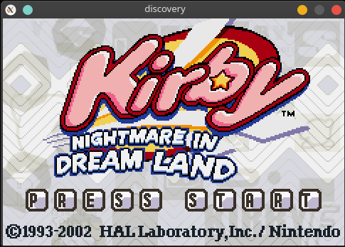

# discovery 
A Gameboy Advance emulator written in C++

## Preamble
When I was 10 years old, I vividly remember watching people on YouTube play Gameboy games on their PC, using a mysterious program called an 'emulator'. Although I didn't have the technical knowhow at the time to install one myself, this experience sparked my curiosity about computer systems. While I learned more and more about how computers worked, the technical details of how a machine could emulate another machine remained unknown to me. I resolved very early in my programming career that I would eventually build an emulator myself. This project represents over a decade of Discovery.

# WARNING
This emulator is a work in progress. It probably won't work very well in its current state. There are currently many unresolved bugs. Please contact me with any questions.

## Usage
Discovery currently requires a GBA BIOS ROM to operate (I am currently working on implementing all of the BIOS calls using high level emulation to cease this requirement). I cannot provide a BIOS ROM for you. DuckDuckGo is your friend here.

To use discovery from the command line:

`./discovery path/to/rom`

Discovery will attempt to load a BIOS in the same directory as the executable called `gba_bios.bin`. To specify a BIOS of your choice:

`./discovery path/to/rom -b path/to/bios`

## Building on Linux based systems
The only dependencies for building discovery are make and [SDL](https://www.libsdl.org). Simply run `make` to build.

## Building on MacOS & Windows
As the only dependencies are make & SDL, discovery should be just as easy to build on non-Linux systems. However, I do not develop for these systems, so you're on your own there ;)

## License
Discovery is licensed under the GPL (version 2). See LICENSE for full license text.

## Legal
Gameboy & Gameboy Advance are copyrights of Nintendo. No copyright infringement was intended in the creation of this project. All information and system specification herein was obtained from sources available to the public. I do not advocate for the possesion of unlicensed copyrighted files in the form of ROM.

## Acknowledgement
As with all GBA homebrew projects, the following documents were indispensible:

[GBATEK - GBA/NDS Technical Info](https://problemkaputt.de/gbatek.htm)

[Tonc's Homebrew Tutorials](https://www.coranac.com/tonc/text/toc.htm)

[ARM7TDMI Reference Sheet](https://www.dwedit.org/files/ARM7TDMI.pdf)

I also referenced other open source emulators for particularly tricky sections:

Shonumi's [GBE+](https://github.com/shonumi/gbe-plus/)

[mGBA](https://github.com/mgba-emu/mgba)

Thank you for sharing the wisdom!
